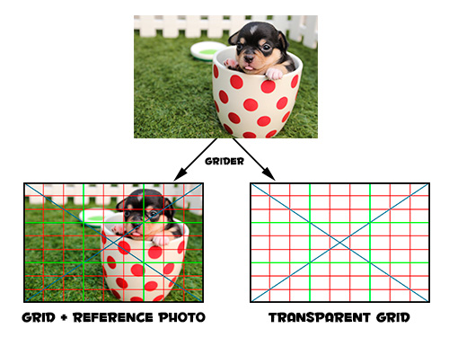

# Grider - The Grid Creator
Create, customize and export grids on top of reference images, for drawing guidance, a tool for artists and those learning how to draw. [https://splitpainter.itch.io/grider](https://splitpainter.itch.io/grider)

With Grider you load a reference image, customize different grids on top of it and then export the grid and import it into your your prefered drawing application to use as a drawing guidance. Since the exported grid is a PNG image, you can also print it and modify as needed.

Grider also exports the grid on top of the reference image, as a separate file.

The Grids produced allow you to learn and draw following **the Leonardo Da Vinci method**.

## How to Use

- Load a reference image
- Choose where the grid will be saved to (Set Save Path)
- Scale the image if you want (the grid will be exported at the selected scale)
- Customize each grid type available. You can choose the line width and color, and also toggle grids on and off.
- Export
- Import the grids into your drawing application and draw/paint (or print it).

## Binaries

Download from the project website: [https://splitpainter.itch.io/grider](https://splitpainter.itch.io/grider).

## Known Issues

- An image at full size may appear clipped in Grider, but it is correctly exported at full size. This will be fixed as soon as scrolling is implemented.
- No way to scroll.
- Additional issues, bug reporting and feature requests: [https://github.com/alfredbaudisch/grider/issues](https://github.com/alfredbaudisch/grider/issues)
